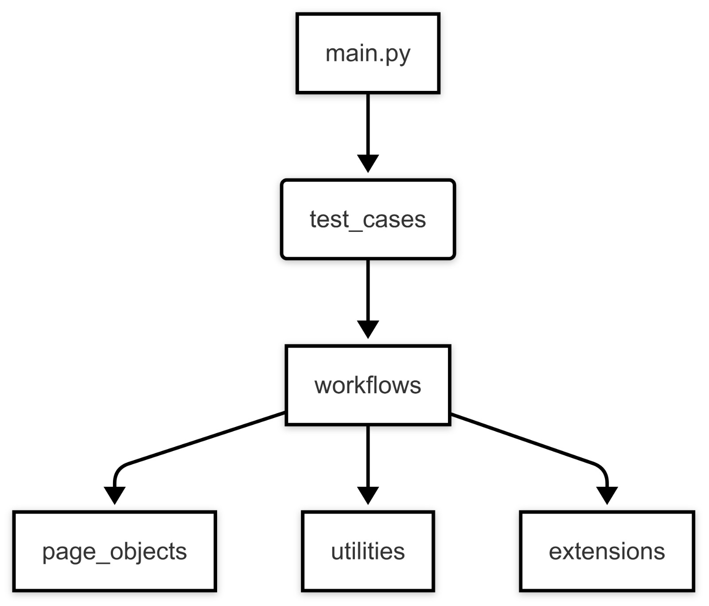

# Fullstack QA Automation


## Overview

### **Overview**  

This project demonstrates a complete test flow covering both **UI and API testing**, using **Python, Pytest, Allure, Selenium, and Requests**.<br>
Following industry best practices and standards.<br>
The **UI tests** focus on verifying Airbnb's search functionality, while the **API tests** validate user registration in **JuiceShop by OWASP**.


## Table of Contents
* [Running Locally](#running-locally)
* [Architecture](#architecture)
  * [Project Structure Diagram](#project-structure-diagram)
  * [Repository Structure](#repository-structure)
* [Test Plan](#test-plan)

# Running Locally

* ** 

## Prerequisites

#### 1. Ensure you have [Python 3](https://www.python.org/downloads/) is installed
#### 2. install & Activate [venv](https://docs.python.org/3/library/venv.html) (Optional)
#### 3. Install dependencies 
```bash
pip install -r requirements.txt
```

#### 4. Run the Project
```bash
python main.py
```
#### 5. Once completed, run the following command to view the results report:
```bash
allure serve allure-results
```
* **
# Architecture 
This project follows the Page Object Model (POM) because it’s the best practice for keeping test automation structured, maintainable, and scalable. 

## Project Structure Diagram

**Test Cases** – The actual execution of tests, built using workflows, steps, and verifications.

**Workflows** – Combines logical and business operations to create structured test scenarios.

**Page Objects** – Where elements are mapped and interactions with the page are defined. Each class represents a specific page.

**Extensions** – A flexible layer between basic operations, allowing extra actions when needed.

**Utilities** – A collection of reusable methods for common tasks.




* ** 
## Repository Structure

```
fullstack-qa-automation/
├── main.py
├── requirements.txt
├── README.md
├── configuration
│   └── data.xml
├── extensions
│   ├── __init__.py
│   ├── api_actions.py
│   ├── api_data.py
│   ├── data_generation.py
│   ├── ui_actions.py
│   └── verifications.py
├── page_objects
│   ├── __init__.py
│   └── web_objects
├── test_cases
│   ├── __init__.py
│   ├── conftest.py
│   ├── test_api_juiceshop.py
│   └── test_ui_airbnb.py
├── utilities
│   ├── __init__.py
│   ├── common_ops.py
│   ├── event_listener.py
│   └── manage_pages.py
└── workflows
    ├── __init__.py
    ├── api_flows.py
    └── web_flows.py
```

* ** 


# **Test Plan**  
## **UI Tests**  

The UI tests focus on verifying Airbnb's **search functionality**. The following aspects are covered:  

1. **Category Display** – Validates that all search categories appear correctly.  
2. **Search Destination Auto-Completion** – Ensures the system suggests relevant destinations as users type.  
3. **Search Destination Error Handling** – Tests incorrect inputs to demonstrate a failure case, including a screenshot in the report.  
4. **Date Picker Functionality** – Verifies that users can select check-in and check-out dates accurately.  
5. **Guest Selection** – Ensures users can correctly add and adjust the number of guests.  


## **API Tests**  

The API tests focus on verifying **JuiceShop's user registration functionality**:

1. **Successful Registration (Positive Flow)** – Validates that a new user can be registered successfully with valid credentials.  
2. **Duplicate Registration Handling (Negative Flow)** – Ensures the system prevents registering with an already used email, returning the appropriate error response.  


